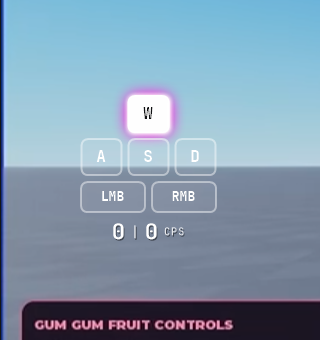
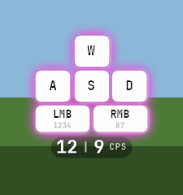
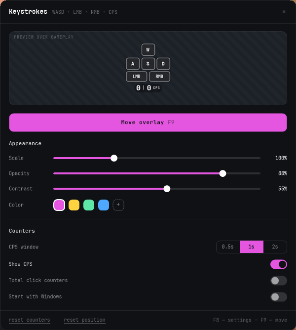
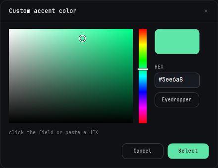
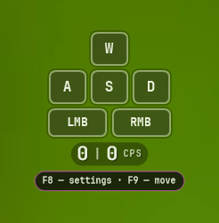
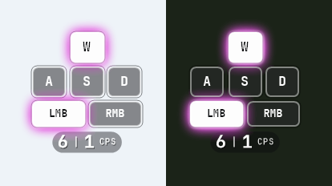

# Keystrokes Overlay

Transparent always-on-top overlay showing pressed **W A S D**, **LMB / RMB** and **CPS** over a game.
Single portable ~630 KB exe, no installer, no runtime to download, no network access.




## Download

Grab **[build/KeystrokesOverlay.exe](build/KeystrokesOverlay.exe)** (use the *Download raw file* button)
and run it. That is the whole app — everything else in this repo is source.

1. Put `KeystrokesOverlay.exe` anywhere (a USB stick works).
2. Run it. A tray icon appears and the overlay shows up on the left, vertically centred.
3. `config.json` is written next to the exe (or to `%APPDATA%\KeystrokesOverlay` if that folder is read-only).

Requires .NET Framework 4.x, which ships with Windows 10/11 — nothing to install.
Windows SmartScreen may warn about an unsigned exe: *More info → Run anyway*, or build it yourself (below).

## Settings and picker




## Hotkeys

| Key | Action |
|---|---|
| `F8` | settings window |
| `F9` | move mode: the overlay grabs the mouse, drag it anywhere; press again to lock it — the position is saved |

Single keys on purpose: `F8`/`F9` are one keypress and still never fire while typing or playing (unlike a bare
`M` or `S`, which would collide with chat and WASD).

On the **first launch** the overlay itself shows a caption — `F8 — settings · F9 — move` — for 12 seconds,
and the tray icon pops a balloon with the same information. After that it never appears again
(`hintShown` in `config.json`).



Tray menu (right-click): Show overlay · Move mode · Settings · Reset counters · Quit. Double-click opens settings.

## Settings window

600px wide, `#0f1115`, radius 12, own title bar, JetBrains Mono throughout, everything applies live —
there is no OK button, the ✕ closes.

- **Live preview** (150px, diagonal-stripe backdrop) renders the real overlay at 90 % and mirrors real
  key/mouse state, so you can press W/A/S/D and watch it while tuning.
- **Move overlay** — the single accent action, with `F9` printed inside the button.
- **Appearance**: `Scale` 60–200 %, `Opacity` 30–100 % (default 88), `Contrast` 0–100 %, `Color` =
  4 preset swatches (`#e455e0 #ffd23f #5ee6a8 #4ea8ff`) + a dashed `+` that opens the custom picker.
  A picked custom colour is kept as a 5th "recent" swatch and persisted.
- **Counters**: `CPS window` as a 3-way segmented control (0.5s / 1s / 2s), then `Show CPS`,
  `Total click counters`, `Start with Windows`.
- **Footer**: `reset counters` / `reset position` links and the `F8 — settings · F9 — move` hint.
  The ✕ turns red on hover.

`Contrast` puts a dark plate behind idle tiles and the CPS row. At 0 % the tiles are the plain
translucent design, which almost disappears over bright scenes; the default 55 % keeps them readable
on snow and in caves alike (left half of each shot is a bright scene, right half a dark one):



## Custom color picker

Modal over a dimmed backdrop: saturation/value square with a ring cursor, hue strip, current-colour
block, `HEX` field (paste supported), and an **Eyedropper** that freezes the screen and shows a 9×
magnifier with the hex under the cursor. Dragging live-previews the colour on the real overlay;
`Cancel` restores the previous one, `Select` applies it.

## How it works

- **Global hooks** `WH_KEYBOARD_LL` / `WH_MOUSE_LL` on their own thread with its own message loop —
  they work while the window is not focused, and repainting can never stall the input chain.
- Keys are matched by **scan code**, so WASD works on any keyboard layout.
- **Layered window** (`UpdateLayeredWindow`, 32-bit ARGB) gives true per-pixel alpha, which is what
  makes the glow and the translucent tiles look like the mockup.
- `WS_EX_TRANSPARENT` lets clicks fall through to the game; it is only removed in move mode.
- `WS_EX_NOACTIVATE` + `WS_EX_TOOLWINDOW` keep the overlay out of focus, Alt+Tab and the taskbar.
- Topmost is re-asserted once a second so borderless-fullscreen games can't cover it.
- **CPS** = clicks within the last N ms (left/right separately), recomputed every 100 ms; a key state
  change repaints immediately instead of waiting for the timer.
- **JetBrains Mono** (Bold + Medium) is embedded in the exe and registered with both GDI+ and GDI,
  so even the hex input uses it. No network, no font install.
- Glow and tile chrome are painted once into sprites and then blitted, so a frame is ~8 blits plus
  ~10 text runs.

## Building from source

```powershell
powershell -ExecutionPolicy Bypass -File build.ps1
```

Compiles `src\*.cs` with the .NET Framework 4 `csc.exe` that ships with Windows (nothing to install),
embeds the fonts and the icon, and writes `build\KeystrokesOverlay.exe`.
The icon is regenerated by `assets\make-icon.ps1`.

### Layout

```
src\Native.cs           P/Invoke: hooks, layered window, hotkeys
src\InputTracker.cs     hook thread, key state, CPS, totals
src\Renderer.cs         the widget into an ARGB bitmap, blurred glow, sprite caches
src\Fonts.cs            embedded JetBrains Mono (GDI+ and GDI)
src\OverlayForm.cs      layered window, click-through, hotkeys, saved position
src\Ui.cs               theme + custom controls: slider, toggle, segmented, button, link, swatch, preview
src\SettingsForm.cs     settings window + autostart
src\ColorPickerForm.cs  custom colour picker + screen eyedropper
src\Config.cs           config.json
src\Program.cs          tray, single instance, entry point
tools\RenderTest.cs     dev tool: sample frames to PNG + benchmark
tools\UiShot.cs         dev tool: colour picker to PNG
```

## Verified

- Overlay renders over other windows with per-pixel alpha.
- A key pressed while another window has focus lights the tile (global hooks work unfocused).
- Click-through: `WindowFromPoint` at the overlay centre returns the window underneath, not the overlay.
- Window styles: `layered + transparent + toolwindow + noactivate + topmost`.
- `F8` opens settings on top of a fullscreen game; the first-run caption renders and then expires.
- Render cost on an idle machine: 1.3 ms idle / 1.9 ms with contrast / 4.3 ms all pressed at 100 %,
  15.7 ms worst case at 200 %. (Measurements taken while a game pinned the CPU at 100 % ranged
  4–20 ms for identical code and were noise, not a regression.)
- Contrast: at 0 % tiles nearly vanish over bright scenes, at 55 % they stay readable everywhere.

## Also in this repo

[`web/europe-quiz/`](web/europe-quiz/) — a standalone offline web page for drilling the
political map of Europe: 47 countries grouped into Northern, Western, Central, Eastern and
Southern Europe, in Ukrainian. Open `index.html` in a browser; nothing to install.

## License

MIT — see [LICENSE](LICENSE). The bundled JetBrains Mono typeface is under the SIL Open Font License 1.1
(`assets/JetBrainsMono-OFL.txt`).
