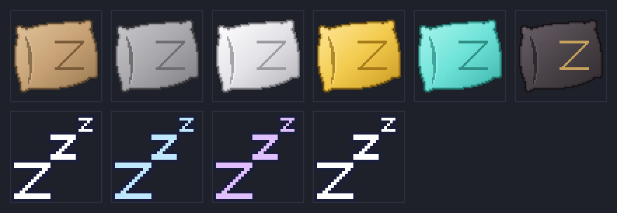

# Sleepy Pillows — ресурс-пак для Minecraft Java 1.21.11

Мечі перетворюються на подушки, а частинки від ударів — на сонне **«Zzz»**.



## Що змінює пак

| Ванільний предмет | Стає |
| --- | --- |
| Дерев'яний меч | Дерев'яна подушка (солом'яна тканина) |
| Кам'яний меч | Кам'яна подушка (сіра вовна) |
| Залізний меч | Залізна подушка (біла бавовна) |
| Золотий меч | Золота подушка (шовк) |
| Алмазний меч | Алмазна подушка (бірюзова) |
| Незеритовий меч | Незеритова подушка (темна із золотою вишивкою) |

| Частинка | Коли з'являється | Стає |
| --- | --- | --- |
| `damage_indicator` | звичайний удар по мобу | біле «Zzz» |
| `crit` | критичний удар (а також слід стріл) | блакитне «Zzz» |
| `enchanted_hit` | удар зачарованою зброєю | фіолетове «Zzz» |
| `sweep_attack` | розмашистий удар | «Zzz», що спливає вгору і згасає (8 кадрів) |

Назви предметів перекладені для `en_us` та `uk_ua` — у грі меч підписаний як «подушка».

## Встановлення

1. Завантаж `dist/SleepyPillows-1.21.11.zip`.
2. У грі: **Options → Resource Packs → Open Pack Folder**.
3. Кинь `.zip` у теку, що відкрилась (не розпаковуй його).
4. Повернись у гру, натисни стрілку біля паку, щоб перемістити його ліворуч, і натисни **Done**.

Тека вручну:
* Windows — `%appdata%\.minecraft\resourcepacks`
* Linux — `~/.minecraft/resourcepacks`
* macOS — `~/Library/Application Support/minecraft/resourcepacks`

## Версії

`pack_format` — **75** (1.21.11). У `pack.mcmeta` також указано
`supported_formats: 64–99`, тож пак вантажиться без попередження
«Incompatible» і на сусідніх версіях (1.21.7+), хоча гарантовано
перевірений саме під 1.21.11.

## Як це працює

* **Форма подушки** обведена з готового ігрового значка (`art/pillow_icon.svg`),
  а не намальована від руки — саме тому вона одразу читається як подушка.
  `tools/trace_icon.py` розтеризує його, заливає діру складки й пакує результат
  у `art/pillow_mask.png` (альфа — тіло, червоний канал — складка). Далі
  генератор накладає на цю маску діагональне освітлення, темнішу окантовку,
  шов складки й вишиту «z» — своїм кольором для кожного рівня. Текстури
  предметів — 64×64: на ванільних 16×16 защипи по кутах зникають.
* **Подушки.** Пак не чіпає ванільні моделі мечів, а перевизначає
  *item model definitions* — `assets/minecraft/items/<tier>_sword.json`
  (формат, доданий у 1.21.4) — і спрямовує їх на власні моделі
  `item/pillow_<tier>`. Ті успадковують `item/pillow.json`, де задані
  `display`-трансформації: подушка тримається пласко й крупніше за клинок,
  а не «за руків'я», як меч.
* **Zzz.** Перевизначені описи частинок у `assets/minecraft/particles/`
  вказують на власні текстури `textures/particle/zzz_*.png`.
  Додатково пак перезаписує й ванільні імена текстур
  (`critical_hit.png`, `enchanted_hit.png`, `damage.png`, `sweep_0..7.png`) —
  це підстраховка, якщо в майбутньому знімку описи частинок переназвуть.

Пак **тільки візуальний**: урон, дальність і швидкість атаки лишаються
ванільними. Подушка б'є рівно так само, як меч, яким вона є насправді.

## Збірка з джерел

Звичайна збірка **не потребує жодних залежностей**: генератор читає готову
`art/pillow_mask.png` власним декодером і пише PNG вручну через `zlib` зі
стандартної бібліотеки.

```bash
python3 tools/generate_textures.py   # перемалювати текстури в src/
bash tools/build.sh                  # текстури + zip у dist/
python3 tools/make_preview.py        # перемалювати docs/preview.png
```

Палітри подушок і розкладка «Zzz» — угорі `tools/generate_textures.py`
(словники `PALETTES` та `PARTICLE_LAYOUT`); правити колір чи форму зручно там.

Перетрасувати маску з `art/pillow_icon.svg` треба лише якщо міняєш сам значок —
тільки цей крок тягне сторонні бібліотеки:

```bash
pip install pillow cairosvg
python3 tools/trace_icon.py
```

## Ліцензія та джерела

Код і згенеровані текстури — той самий MIT, що й у решті репозиторію,
див. [LICENSE](../../LICENSE).

Силует подушки обведено зі значка «Pillow» авторства Delapouite
([game-icons.net](https://game-icons.net/), CC BY 3.0), узятого з
[Вікісховища](https://commons.wikimedia.org/wiki/File:Pillow_-_Delapouite_-_game-icons.svg).
Оригінал лежить у `art/pillow_icon.svg`.
