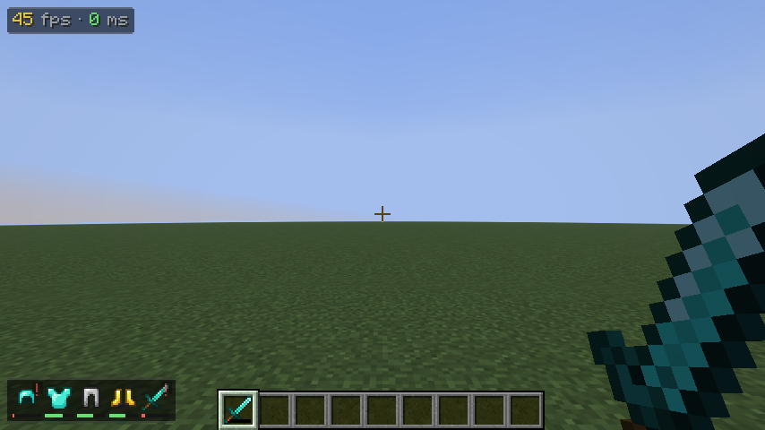
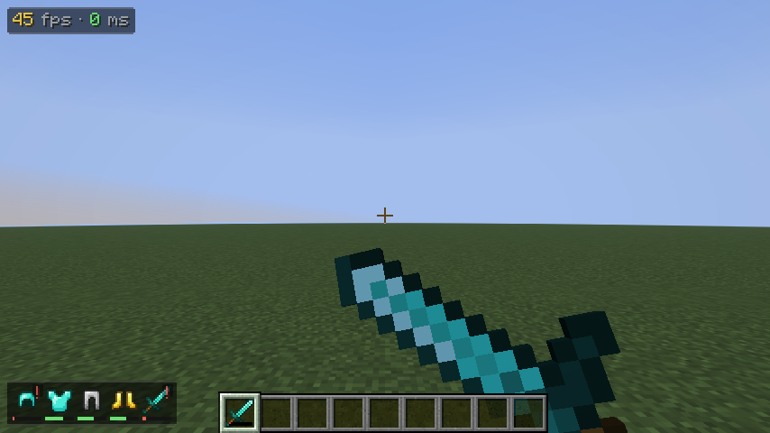
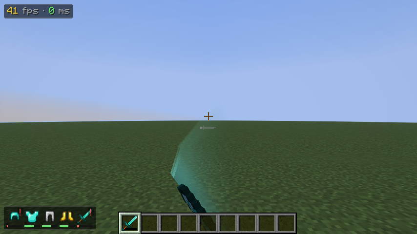
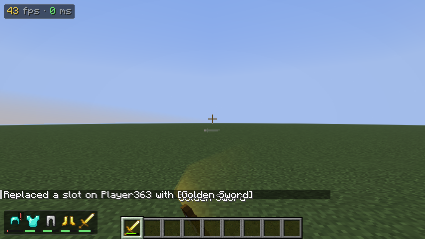
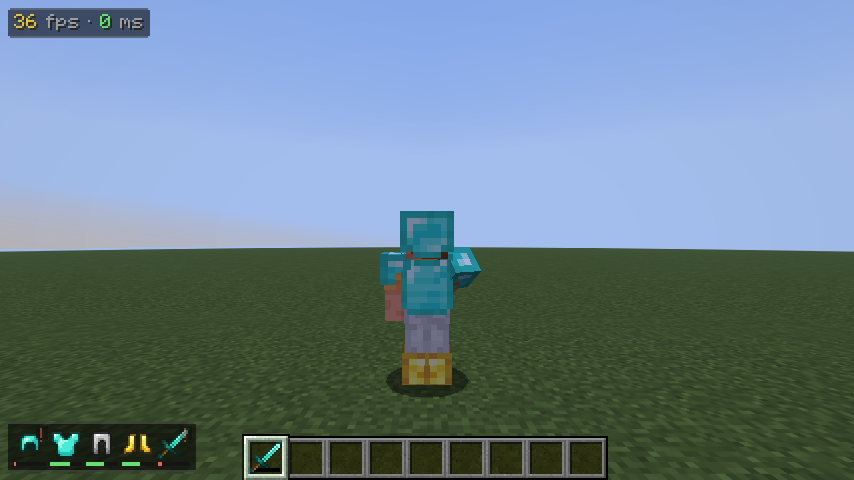

# Old Sword Blocking

A small client side visual mod for **Minecraft 1.21.11**, **Fabric**.

It started as one thing — bringing back the pre-1.9 sword block — and has grown a few more
cosmetics that live in the same place. Everything here is **visual only and client side**: no
packets are added or changed, the server is never told anything, no gameplay value moves, and
nobody else sees any of it. Only the person using it needs it installed.









Every shot comes straight out of the automated client test described at the bottom.

## What it does

### The 1.8 sword block

Hold right click with a sword and the sword goes up, the way it did before 1.9. Your own body
raises the arm in F5 too.

The pose is not invented. Vanilla still carries it: an item whose `UseAction` is `BLOCK` and which
is not a shield gets exactly that transform in `HeldItemRenderer` — the modern descendant of 1.8's
`ItemRenderer#doBlockTransformations`. Swords simply never reach that branch any more, because
since 1.9 right clicking a sword does nothing at all. So the mod takes the branch for them.

Be clear about the limit, because it matters in PvP: you take **exactly the same damage**. There is
no 50% reduction, no knockback change, no hit cancelling. Real blocking needs a server side mod
that every player installs — a different project.

The pose is suppressed whenever right click means something else, so it never lies to you:

| Situation | Pose |
|---|---|
| Sword in main hand, nothing else happening | shown |
| Any screen open (chest, chat, inventory), window unfocused | hidden |
| Eating, drawing a bow, raising a shield, using a spyglass | hidden |
| Placing a block from the off hand at a block you are looking at | hidden |
| Spectator | hidden |

### Swing trail

The blade drags a glowing streak behind it as you swing. Each rendered frame the hilt and tip of
the blade are recorded, and the streak is the ribbon stitched between those frames — narrowing and
fading into its tail, soft at the edges rather than a flat band.

**Every sword material gets its own streak.** Wood is a dull warm brown, gold a bright amber,
diamond cyan, netherite a pale violet, and so on. Tridents and maces have their own too. Colours
are picked to read against the world rather than to match the item exactly: netherite's real near
black would be invisible as a trail, so it gets the sheen the item has in bright light instead.

| Material | Streak |
|---|---|
| wooden | `#C79155` |
| stone | `#BFBFBF` |
| copper | `#E8874F` |
| iron | `#E9EEF5` |
| golden | `#FFD84D` |
| diamond | `#7FF3E4` |
| netherite | `#C0A8C8` |
| trident | `#4FD8CF` |
| mace | `#9A87C4` |

Anything unrecognised — a modded sword — falls back to `trail.color`, and can be given its own
colour with `trail.colorsByItem`. Set `trail.colorPerMaterial` to `false` for one colour throughout.

The streak follows a vanilla sword's blade exactly, because its two ends are placed where the
`item/handheld` first person display transform actually puts them. Both endpoints, opacity and
length are in the config, so a resource pack with unusual sword models can be dialled in by hand.

### FPS and ping

One compact line — `45 fps · 18 ms` — with each number coloured by how healthy it is and the units
dimmed, so the eye lands on the digits. Hidden automatically while the F3 screen is up, since that
already says both, and while any screen is open.

### Gear durability, with a warning

A small strip of your armour and held tools: the icon, a durability bar under it, and nothing else
until it matters. Anything that drops into the danger zone gets a pulsing red badge in the corner
of its icon and, **once**, a line in chat naming the piece — so a helmet never quietly pops mid
fight. A repair or a swap arms the warning again. Turn on `hud.showPercent` if you want the numbers
as well.

Both widgets sit in a soft panel so they read as one piece of UI; `hud.background` turns it off for
bare text.

## Install

1. [Fabric Loader](https://fabricmc.net/use/installer/) 0.19.3 or newer, for Minecraft 1.21.11.
2. [Fabric API](https://modrinth.com/mod/fabric-api) for 1.21.11 into `mods/`.
3. **[dist/old-sword-blocking-1.2.0.jar](dist/old-sword-blocking-1.2.0.jar)** into `mods/`
   (use the *Download raw file* button on GitHub).

Java 21 or newer, same as 1.21.11 itself.

## Controls

- **Keybind** — *Options → Controls → Gameplay → Toggle sword blocking*. Unbound by default so it
  cannot collide with a key you already use. It toggles the block pose, not the HUD.
- **Commands** — `/oldswordblock status`, `/oldswordblock toggle`, `/oldswordblock reload`.
  These are client commands: they never reach the server.

## Config

`config/old-sword-blocking.json`, written on first launch. `/oldswordblock reload` re-reads it
without restarting the game.

### Block pose

| Key | Default | What it does |
|---|---|---|
| `enabled` | `true` | Master switch for the whole mod |
| `firstPerson` | `true` | The pose on your own hand |
| `thirdPerson` | `true` | Your own body in F5 raises the arm too |
| `allowSwords` | `true` | Everything in the `minecraft:swords` tag, modded swords included |
| `allowAxes` | `false` | Same for `minecraft:axes` |
| `allowAnyItem` | `false` | Block with literally anything |
| `extraItems` | `[]` | Extra ids, e.g. `["minecraft:trident"]` |
| `requireEmptyOffhand` | `false` | Closest to 1.8, which had no off hand at all |
| `suppressWhenPlacingFromOffhand` | `true` | Do not pose while right click is stacking blocks |
| `allowWhileSwinging` | `true` | 1.8 swung the blocked sword too. `false` drops the pose for the duration of a swing |
| `transitionTicks` | `2` | Ticks to ease in and out. `0` snaps instantly, like 1.8 |
| `offsetX/Y/Z`, `rotationX/Y/Z`, `scale` | 1.8 values | Pose tuning, see below |

Those pose defaults are Minecraft's own numbers for a non-shield item with `UseAction.BLOCK`.
`offsetX`, `rotationY` and `rotationZ` are mirrored automatically if you play left handed.

### `trail`

| Key | Default | What it does |
|---|---|---|
| `enabled` | `true` | |
| `samples` | `16` | How many rendered frames the streak spans |
| `color` | `#8AE9FF` | Fallback for anything the material table does not know |
| `colorPerMaterial` | `true` | Give each sword material its own streak colour |
| `colorsByItem` | `{}` | Per item overrides, e.g. `{"somemod:katana": "#FF4D6D"}` |
| `opacity` | `0.85` | Opacity at the blade end; the tail always fades to nothing |
| `nearX/Y/Z`, `farX/Y/Z` | blade ends | Where the streak sits, in hand space. Mirrored for left handers |

The streak uses the same item rules as the block pose, so whatever you can block with is what
leaves a streak.

### `hud`

| Key | Default | What it does |
|---|---|---|
| `background` | `true` | The soft panel behind each widget |
| `showFps`, `showPing` | `true` | |
| `infoAnchor` | `TOP_LEFT` | `TOP_LEFT`, `TOP_RIGHT`, `BOTTOM_LEFT` or `BOTTOM_RIGHT` |
| `infoOffsetX/Y` | `4` | Pixels inwards from that corner |
| `showGear` | `true` | The armour and tool strip |
| `gearAnchor` | `BOTTOM_LEFT` | |
| `gearOffsetX/Y` | `4` | |
| `onlyDamagedGear` | `false` | Hide pieces still at full durability |
| `showPercent` | `false` | Add a percentage under each bar |
| `includeOffHand` | `true` | |
| `warnBelowPercent` | `15` | At or below this, a piece gets the exclamation mark |
| `warnInChat` | `true` | The one off chat line naming the piece |

## How it works

Two mixins and two HUD elements, all client only:

- `HeldItemRendererMixin` — at the head of `renderFirstPersonItem`: feeds the blade's position to
  the trail, then, when the mod says you are blocking, applies vanilla's own equip offset and
  swing, then the old block transform, and hands the stack straight back to vanilla's item
  renderer. Nothing about how the item is drawn is reimplemented.
- `PlayerEntityRendererMixin` — turns your own `ArmPose.ITEM` into `ArmPose.BLOCK` in third person,
  and only ever for the local player, so other people's models are untouched.
- `InfoHud` and `GearHud` — registered through Fabric's `HudElementRegistry`, drawing after the
  vanilla HUD.

The "am I blocking" decision lives in `BlockingState` and reads exactly one thing from the game:
whether the use key is held. It writes nothing back.

## Build from source

```
cd old-sword-blocking
./gradlew build
```

The jar lands in `build/libs/`. `./gradlew runClient` launches a dev client with the mod loaded.

There is also a real client test:

```
./gradlew runGametestClient
```

It boots an actual game, creates a creative world, hands the player a battered set of armour and a
sword, holds the use key, swings, and asserts that the mod enters and leaves the block state and
that a swing actually produces trail geometry — including that an empty hand never poses.
Screenshots of each stage land in `run/screenshots/`; the ones in `docs/` came from a run of it.

Built and verified against Minecraft 1.21.11, Yarn 1.21.11+build.6, Loader 0.19.3,
Fabric API 0.141.6+1.21.11, Loom 1.17.20, Gradle 9.5.

## Notes

**Black squares where items should be.** Since 1.21.9 every item drawn in a frame takes a slot in a
GPU atlas whose size is capped by your device's maximum texture size. A full creative tab can fill
that atlas on its own where that cap is small — some Android launchers and GL translation layers
sit well below a desktop GPU — and whatever does not fit renders as a black square. The gear strip
therefore draws nothing at all while a screen is open, so it never spends those slots at the worst
possible moment. If you still see black squares with the strip hidden, the cap is the cause and
nothing in this mod can raise it: lowering the **GUI Scale** shrinks every atlas cell and fits far
more items.

## Compatibility

Anything else that mixes into `HeldItemRenderer#renderFirstPersonItem` at head and cancels
(some animation and "old animations" mods do) can conflict — whichever cancels first wins. If your
sword pose stops appearing after adding such a mod, that is the cause.

The mod id stays `oldswordblocking` even though it now does more than blocking, so existing
configs keep working.

## Licence

MIT, same as the rest of this repository.
