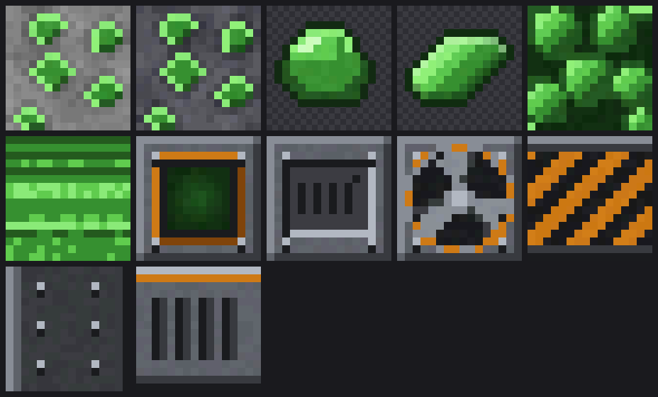
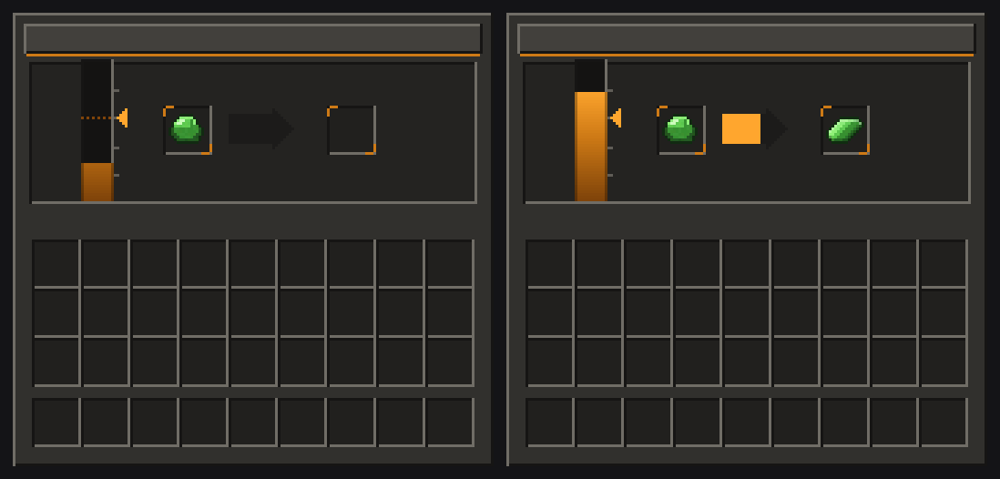
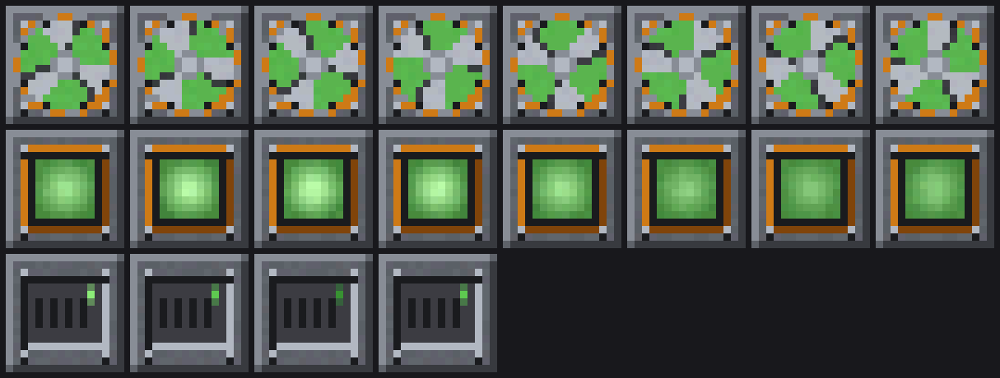

# Uranium Ore — Minecraft 1.21.4 (Fabric)

Adds uranium to the overworld: ore in both stone and deepslate, raw uranium,
uranium ingots, and the two matching storage blocks.



## Contents

| Thing | ID | Notes |
| --- | --- | --- |
| Uranium Ore | `uraniummod:uranium_ore` | Hardness 3.0, drops 1–2 raw uranium |
| Deepslate Uranium Ore | `uraniummod:deepslate_uranium_ore` | Hardness 4.5, drops 1–2 raw uranium |
| Raw Uranium | `uraniummod:raw_uranium` | Smelts into an ingot |
| Uranium Ingot | `uraniummod:uranium_ingot` | |
| Block of Raw Uranium | `uraniummod:raw_uranium_block` | 9× raw uranium |
| Block of Uranium | `uraniummod:uranium_block` | 9× ingot |
| Centrifuge | `uraniummod:centrifuge` | Redstone-powered; the only way to make ingots |

Everything appears in its own **Uranium** creative tab, and is also mixed into
the vanilla Natural / Ingredients / Building Blocks tabs.

### Mining

Both ores need an **iron pickaxe or better** — mining with stone or wood drops
nothing. Fortune works (`ore_drops` formula, same as vanilla iron/copper), and
Silk Touch drops the ore block itself. Breaking an ore drops 3–7 XP.

### World generation

Uranium is deliberately rarer and deeper than iron. Two placements are added to
every overworld biome in the `UNDERGROUND_ORES` step:

- `uranium_ore_placed` — 2 veins/chunk, size 5, trapezoid distribution from
  y=-64 to y=8, 50% discard when exposed to air.
- `uranium_ore_buried_placed` — 3 veins/chunk, size 6, uniform from y=-64 to
  y=16, always discarded when exposed to air (so it hides in solid rock).

Measured on a freshly generated world (49 spawn chunks, seed `uraniumtest`):

```
uraniummod:uranium_ore                92    1.9 per chunk
uraniummod:deepslate_uranium_ore     671   13.7 per chunk
                                    ----   ----
                          uranium    763   15.6 per chunk

for reference, in the same chunks:
minecraft:iron_ore    + deepslate   3588   73.2 per chunk
minecraft:diamond_ore + deepslate   1110   22.7 per chunk
```

So it lands rarer than diamond and about a fifth as common as iron. By depth:

```
y  10..19    ############
y   0..9     #####################
y -10..-1    ######################################
y -20..-11   #################################
y -30..-21   ########################################
y -40..-31   ############################################
y -50..-41   ###############################
y -60..-51   ####################
y -64..-61   ###
```

In practice it is most common between y=-50 and y=0, peaking around y=-35, and
you will rarely see it exposed on a cave wall.

`tools/verify_worldgen.py` reproduces those numbers — it parses the generated
region files directly and counts placed blocks.

### The centrifuge

A normal furnace will **not** smelt raw uranium — refining it needs the
centrifuge, crafted from 8 iron ingots around a redstone block and a blast
furnace:

```
I I I      I = iron ingot
I R I      R = block of redstone
I F I      F = blast furnace
```

Right-click it to open its screen: one input slot, one output slot, a progress
arrow, and a heat gauge down the left-hand side with a notch marking the
temperature you're waiting for.



*Left: cold, holding raw uranium, doing nothing. Right: up to temperature and
refining.* The gauge is marked with tick marks, a dashed line at the operating
temperature and an amber arrow pointing at it, so the target is visible rather
than guessed. Hovering the gauge shows the exact percentage and whether it is
hot enough yet.

### The block

The centrifuge is not a plain cube. Its model is a hazard-striped plinth, four
corner struts framing a recessed body, and a rotor housing on top, so it reads
as machinery from across the room.

While it is running, three of its textures animate:



*Top: the rotor, 8 frames. Middle: the window pulsing as the charge spins up.
Bottom: the status lamp.* The rotor's 8 frames cover 120° of a 3-blade rotor, so
the loop is seamless. All three only play in the `lit=true` state — a cold
centrifuge is completely still, which makes "is it actually running?" answerable
at a glance.

The centrifuge does nothing on its own. **Give it a redstone signal** and it
starts heating up; cut the signal and it cools back down. It only refines while
it is at or above operating temperature, so you power it, wait for the gauge to
pass the notch, and then it works through its input.

| | Value |
| --- | --- |
| Maximum heat | 1000 |
| Operating temperature | 600 (the notch on the gauge) |
| Heating | +2 per tick while powered — 15 s from cold to operating |
| Cooling | −3 per tick while unpowered — about 17 s from full to cold |
| Refining | 160 ticks (8 s) per ingot, once hot enough |

Losing temperature mid-run rewinds the progress arrow rather than pausing it, so
a centrifuge that keeps browning out never finishes anything. Hoppers work:
insert from any side but the bottom, pull finished ingots out from underneath.
It emits a light level of 8 while it's up to temperature.

### Other recipes

- 9 raw uranium ⇄ block of raw uranium
- 9 uranium ingot ⇄ block of uranium

## Installing

A prebuilt jar is committed at
[`dist/uranium-ore-1.0.0.jar`](dist/uranium-ore-1.0.0.jar).

1. Minecraft **1.21.4** with **Fabric Loader** 0.16.0 or newer.
2. Install [Fabric API](https://modrinth.com/mod/fabric-api) for 1.21.4 — this
   mod will not load without it.
3. Drop `uranium-ore-1.0.0.jar` into your `mods/` folder.

Works on both client and server (`"environment": "*"`). On a multiplayer server
it must be installed on the server; clients need it too, for the textures.

## Building from source

Requires JDK 21. The Gradle wrapper pulls everything else down.

```bash
cd uranium-mod
./gradlew build
```

The jar lands in `build/libs/uranium-ore-1.0.0.jar`. Ignore the
`-sources.jar` next to it.

To try it in a dev environment:

```bash
./gradlew runClient    # or runServer
```

### Versions

| | |
| --- | --- |
| Minecraft | 1.21.4 |
| Yarn mappings | 1.21.4+build.8 |
| Fabric Loader | 0.19.3 |
| Fabric API | 0.119.4+1.21.4 |
| Fabric Loom | 1.14.9 (needs Gradle 9.2+) |

## Textures

All the 16×16 textures, plus the centrifuge's GUI sheet, are generated procedurally by
`tools/gen_textures.py` (pure Python, no dependencies) rather than being
hand-drawn, so the palette can be retuned in one place. Re-run it to
regenerate everything:

```bash
python3 tools/gen_textures.py
```

Helper scripts alongside it:

| Script | What it does |
| --- | --- |
| `tools/gen_textures.py` | Generates every texture, the animation strips and the GUI sheet |
| `tools/validate_assets.py` | Walks blockstates → models → textures and fails if any reference doesn't resolve, or an animation strip isn't a whole number of frames |
| `tools/preview_textures.py` | Contact sheet of the block and item textures |
| `tools/preview_animation.py` | Lays the animation frames out side by side |
| `tools/preview_gui.py` | Mocks up the live centrifuge screen from the GUI sheet |
| `tools/verify_worldgen.py` | Counts placed blocks in a generated world |

`validate_assets.py` is worth running after any model or texture change — a
model pointing at a missing texture otherwise only shows up as an untextured
block once you're in-game.

## Layout

```
src/main/java/net/pero/uraniummod/
  UraniumMod.java              entrypoint
  block/ModBlocks.java         the four blocks + their BlockItems
  item/ModItems.java           raw uranium, uranium ingot
  item/ModItemGroups.java      creative tabs
  world/ModPlacedFeatures.java registry keys for the placed features
  world/gen/ModWorldGeneration.java  adds them to overworld biomes
  block/CentrifugeBlock.java   facing + lit block, opens the screen
  block/entity/CentrifugeBlockEntity.java  heat, progress, inventory, ticking
  block/entity/ImplementedInventory.java   SidedInventory boilerplate
  screen/CentrifugeScreenHandler.java      slots + synced heat/progress
  client/UraniumModClient.java             registers the screen
  client/screen/CentrifugeScreen.java      draws the gauge and arrow

src/main/resources/
  assets/uraniummod/...        models, blockstates, textures, lang
  data/uraniummod/...          loot tables, recipes, worldgen JSON
  data/minecraft/tags/...      mineable/pickaxe, needs_iron_tool
```

Note that on 1.21.4 every item needs both a model in
`assets/uraniummod/models/item/` **and** an item-model definition in
`assets/uraniummod/items/` — the second directory is the 1.21.4 item model
system, and items render as missing-texture without it.

## License

MIT — see `LICENSE`.
