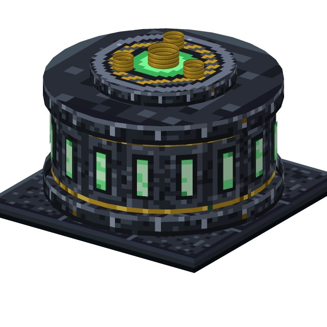

# Uranium Ore — Minecraft 1.21.4 (Fabric)

Adds uranium to the overworld, and a reason to care about it: ore in stone and
deepslate, a redstone-powered centrifuge that **enriches** raw uranium into two
isotopes, a tool tier, a fuel cell, and radiation that punishes carrying the raw
material around without shielding.


## The loop

```
uranium ore ──mine──► raw uranium ──centrifuge──► uranium-238  (every run)
                           │                     uranium-235  (7% of runs)
                    RADIOACTIVE                        │
                    in your hand                       │
                                          9× U-238 ──► uranium ingot ──► tools
                                             U-238 ──► shielded armour
                                             U-235 ──► fuel cell
```

Raw uranium is the only radioactive item. Everything past the centrifuge is
safe to carry, which is what makes refining worth doing.

## Contents

| Thing | ID | Notes |
| --- | --- | --- |
| Uranium Ore | `uraniummod:uranium_ore` | Hardness 3.0, drops 1–2 raw uranium |
| Deepslate Uranium Ore | `uraniummod:deepslate_uranium_ore` | Hardness 4.5, drops 1–2 raw uranium |
| Raw Uranium | `uraniummod:raw_uranium` | **Radioactive in hand.** Centrifuge feedstock |
| Uranium-238 | `uraniummod:uranium_238` | The bulk isotope. Shielding, and 9× → an ingot |
| Uranium-235 | `uraniummod:uranium_235` | Rare. The only thing that fuels a cell |
| Uranium Ingot | `uraniummod:uranium_ingot` | Tool material |
| Uranium Fuel Cell | `uraniummod:uranium_fuel_cell` | Furnace fuel, 32000 ticks — 20× coal |
| Block of Raw Uranium | `uraniummod:raw_uranium_block` | 9× raw uranium |
| Block of Uranium | `uraniummod:uranium_block` | 9× ingot |
| Centrifuge | `uraniummod:centrifuge` | 3×3×2, redstone-powered, needs heat |
| Uranium tools | `uraniummod:uranium_{pickaxe,axe,shovel,hoe,sword}` | Between diamond and netherite |
| Shielded armour | `uraniummod:shielded_{helmet,chestplate,leggings,boots}` | Stops radiation |

Everything appears in its own **Uranium** creative tab, and is also mixed into
the vanilla Natural / Ingredients / Tools / Combat / Building Blocks tabs.

### Mining

Both ores need an **iron pickaxe or better** — mining with stone or wood drops
nothing. Fortune works (`ore_drops` formula, same as vanilla iron/copper), and
Silk Touch drops the ore block itself. Breaking an ore drops 3–7 XP.

### World generation

Uranium is deliberately rarer and deeper than iron. Two placements are added to
every overworld biome in the `UNDERGROUND_ORES` step:

- `uranium_ore_placed` — 2 veins/chunk, size 5, trapezoid distribution from
  y=-64 to y=8, 50% discard when exposed to air.
- `uranium_ore_buried_placed` — 3 veins/chunk, size 6, uniform from y=-64 to
  y=16, always discarded when exposed to air (so it hides in solid rock).

Measured on a freshly generated world (49 spawn chunks, seed `uraniumtest`):

```
uraniummod:uranium_ore                92    1.9 per chunk
uraniummod:deepslate_uranium_ore     671   13.7 per chunk
                                    ----   ----
                          uranium    763   15.6 per chunk

for reference, in the same chunks:
minecraft:iron_ore    + deepslate   3588   73.2 per chunk
minecraft:diamond_ore + deepslate   1110   22.7 per chunk
```

So it lands rarer than diamond and about a fifth as common as iron. By depth:

```
y  10..19    ############
y   0..9     #####################
y -10..-1    ######################################
y -20..-11   #################################
y -30..-21   ########################################
y -40..-31   ############################################
y -50..-41   ###############################
y -60..-51   ####################
y -64..-61   ###
```

In practice it is most common between y=-50 and y=0, peaking around y=-35, and
you will rarely see it exposed on a cave wall.

`tools/verify_worldgen.py` reproduces those numbers — it parses the generated
region files directly and counts placed blocks.

### The centrifuge

A normal furnace will **not** smelt raw uranium — refining it needs the
centrifuge, crafted from 8 iron ingots around a redstone block and a blast
furnace:

```
I I I      I = iron ingot
I R I      R = block of redstone
I F I      F = blast furnace
```

Right-click it to open its screen: one input slot, one output slot, a progress
arrow, and a heat gauge down the left-hand side with a notch marking the
temperature you're waiting for.


*Left: cold, holding raw uranium, doing nothing. Right: up to temperature and
refining.* The gauge is marked with tick marks, a dashed line at the operating
temperature and an amber arrow pointing at it, so the target is visible rather
than guessed.

The current heat is printed as a percentage under the gauge, and it changes
colour once the machine is hot enough, so you can read the exact value instead
of eyeballing the bar against the notch. Hovering the gauge shows the raw
figure (`Heat: 740 / 1000`) and whether it is up to temperature.

### The block

The centrifuge is a **3×3 machine, two blocks tall** — eighteen blocks of space.
You place one item and it claims the whole footprint automatically, the way a
Factorio building does; breaking any part of it takes the whole machine down and
returns the item. Hoppers work against any face.

It is **hardness 2.0 and not tool-gated**: a pickaxe is quick, but breaking it
bare-handed still works and still drops the item. It used to be hardness 3.5
with `requiresTool()`, which meant seventeen seconds of punching for no drop —
indistinguishable, in play, from a block that refuses to break.



*Idle, running, and running from the front.* Idle really is idle — the panels are
dark and the port is dead. Everything lit is an **emissive** pass drawn at full
lightmap brightness, so it glows in an unlit cave rather than merely being green,
and its brightness follows the machine's heat.

The drum is sized to nearly fill the 3×3 footprint, so the foundation shows only
as a narrow dark rim — a shadow line under the machine rather than a slab it is
standing on. Earlier versions decorated that slab; the fix was to stop having
one worth decorating.

Only the controller carries the renderer; the other seventeen blocks are
invisible filler that forward interaction, hoppers and breaking to it, and store
their offset in the block state so they cost no tick or storage overhead. While
it runs:

- the **drum spins**, at a speed proportional to heat, winding up as it warms
  and coasting down when power is cut
- the **drive shaft** turns faster than the drum, with its counterweights
- the panels and rotor port **glow and pulse**
- **uranium steam** — a custom particle, not vanilla smoke — vents from the top,
  swelling and bleeding from hot green to plain grey as it cools
- sparks jump off the collar seam and a low **hum** plays

Because the controller sits in the middle of its own footprint, surrounded by
its own parts, redstone is read across the whole structure rather than at the
controller — asking the controller alone would always answer no. The renderer
has the same problem for a different reason: the light value handed to a block
entity renderer is sampled at the block entity's own position, and that position
is sealed inside eighteen solid blocks, where the light level is zero. Sampling
one block above the machine instead — open air — is what stops it rendering
almost black.

Nothing here needed a client to check. Registration, the recipe type, the
enrichment split, redstone gating and the crafting recipes were all verified
against a dedicated server, and the exposure arithmetic has its own test that
runs without Minecraft at all (`tools/test/run.sh`). Two real bugs came out of
that: the fuel cell originally asked for 40000 ticks of burn time, which
overflows the NBT *short* a furnace stores it in and silently produces a fuel
that cannot be lit; and an earlier version read redstone at the controller,
which is sealed inside its own parts and therefore never powered.

Textures are sized to the surface they wrap. The tower map is **128×24**: the
drum is about 119 block-pixels around and 14 tall, so a square texture would
have to stretch to fit. The plinth is drawn as nine per-block boxes for the same
reason. Neither carries baked left-right shading, because entity render layers
light curved surfaces from the vertex normals.

None of this needs an extra mod.

### Enrichment

The centrifuge does not convert one thing into another. It **splits**:

| In | Out, always | Out, sometimes | Time | Heat |
| --- | --- | --- | --- | --- |
| 1 raw uranium | 1 × U-238 | 1 × U-235, 7% | 160 ticks | 600 |
| 1 block of raw uranium | 9 × U-238 | 1 × U-235, 50% | 900 ticks | 800 |

So U-238 piles up and U-235 does not, which is the whole reason to leave the
machine running. Feeding whole blocks is slower per item but much better odds on
the rare isotope — worth it once you have a mine going.

Both outputs have their own slot, and a run will not start unless **both** have
room. That is deliberate: without the check the machine would happily eat an
input, find the byproduct slot full, and throw away the one output a player
would actually miss.

`uraniummod:centrifuging` is a real recipe type, so a datapack can add its own:

```json
{
  "type": "uraniummod:centrifuging",
  "ingredient": "minecraft:gold_ingot",
  "result":    { "id": "minecraft:gold_nugget", "count": 4 },
  "byproduct": { "id": "uraniummod:uranium_235", "count": 1 },
  "byproduct_chance": 1.0,
  "processing_time": 40,
  "heat": 200
}
```

`byproduct`, `byproduct_chance`, `processing_time` and `heat` are all optional.
Process time and heat are per recipe, so a datapack can make one recipe demand a
hotter machine than another.

### Radiation

Hold **raw uranium** — the item or the block — and you take damage over time.
Nothing else in the mod is radioactive: ingots, both isotopes and the refined
block are all inert, because the point of the centrifuge is that refining makes
uranium safe to handle.

Exposure is counted in raw uranium, with a block worth nine. Under 16 is
Radiation I, 16 or more is II, 64 or more is III; the levels differ in how often
they tick and how hard. It bypasses armour points and enchantments — a
breastplate is not shielding.

**Shielded armour** is the only defence. Each worn piece stops a quarter of the
exposure and the full set stops all of it, at any amount. It is made from U-238,
which is what real shielding is made of, and it is deliberately plain iron-grade
protection otherwise: it is safety gear, not a combat set.

### Tools

Uranium tools sit between diamond and netherite: 2200 uses, mining speed 9.0,
+3.5 attack. They mine everything diamond can, and nothing it cannot.

### Other recipes

- 9 raw uranium ⇄ block of raw uranium
- 9 uranium ingot ⇄ block of uranium
- 9 U-238 → 1 uranium ingot
- 1 U-235 + 4 iron ingots → 1 uranium fuel cell

## Installing

A prebuilt jar is committed at
[`dist/uranium-ore-1.0.0.jar`](dist/uranium-ore-1.0.0.jar).

1. Minecraft **1.21.4** with **Fabric Loader** 0.16.0 or newer.
2. Install [Fabric API](https://modrinth.com/mod/fabric-api) for 1.21.4 — this
   mod will not load without it.
3. Drop `uranium-ore-1.0.0.jar` into your `mods/` folder.

Works on both client and server (`"environment": "*"`). On a multiplayer server
it must be installed on the server; clients need it too, for the textures.

## Building from source

Requires JDK 21. The Gradle wrapper pulls everything else down.

```bash
cd uranium-mod
./gradlew build
```

The jar lands in `build/libs/uranium-ore-1.0.0.jar`. Ignore the
`-sources.jar` next to it.

To try it in a dev environment:

```bash
./gradlew runClient    # or runServer
```

### Versions

| | |
| --- | --- |
| Minecraft | 1.21.4 |
| Yarn mappings | 1.21.4+build.8 |
| Fabric Loader | 0.19.3 |
| Fabric API | 0.119.4+1.21.4 |
| Fabric Loom | 1.14.9 (needs Gradle 9.2+) |

## Textures

All the 16×16 textures, plus the centrifuge's GUI sheet, are generated procedurally by
`tools/gen_textures.py` (pure Python, no dependencies) rather than being
hand-drawn, so the palette can be retuned in one place. Re-run it to
regenerate everything:

```bash
python3 tools/gen_textures.py
```

### Working in palette indices

Generating textures has one characteristic failure: it is easy to write code
that blends two colours to taste, and a 16×16 texture drawn that way ends up
with forty-odd near-identical shades. That, more than any shape, is what makes
a texture look machine-made. Measured against the game's own art:

| | colours | top 4 shades cover |
| --- | --- | --- |
| Vanilla blocks (emerald ore, iron block, raw iron block) | 7–12 | 67–82% |
| Vanilla items (iron ingot, raw iron, diamond pickaxe) | 8–11 | 63–75% |
| This mod, before | 11–46 | 20–71% |
| This mod, now | 5–12 | 57–94% |

So the generators pick a palette **index**, never a colour. `URANIUM` is six
steps and nothing blends between them; surface grain comes from stepping one
place along the ramp rather than from a random brightness offset. Budgets live
in `tools/texture_budget.py` and are enforced twice — once as the generator
writes each file, and again by `tools/validate_assets.py` against what actually
shipped, so a hand-edited png cannot slip past either.

The structure follows the game's own idioms rather than being invented:

- **Ore** is vanilla's stone greys in vanilla's own histogram (`rank_quantise`
  ranks the noise and cuts it to a fixed tonal mix), with crystals that are
  mostly dark and carry one bright glint. Filling a cluster with the lit greens
  instead turns every gem into a soft blob.
- **Refined metal** is a three-row cycle — bright lip, flat face, shadow line —
  each row with a fixed profile across the width. Vanilla's iron block spans 66
  levels of luminance; drawing a plate with the crystal ramp spans 200 and
  produces a green barcode, which is exactly what the first two attempts did.
- **Raw ore items** are visibly rough, so they mottle; an **ingot** has been
  melted and poured, so it is flat faces meeting at a hard fold. Shading the
  ingot with a gradient made it read as a pebble.

Helper scripts alongside it:

| Script | What it does |
| --- | --- |
| `tools/gen_textures.py` | Generates every texture, the animation strips and the GUI sheet |
| `tools/validate_assets.py` | Walks blockstates → models → textures and fails if any reference doesn't resolve, an animation strip isn't a whole number of frames, an equipment layer names a texture that isn't there, or a texture is over its colour budget |
| `tools/preview_textures.py` | Contact sheet of the block and item textures |
| `tools/preview_gui.py` | Mocks up the live centrifuge screen from the GUI sheet |
| `tools/render_model.py` | Software-renders a block model to a PNG, so geometry can be checked without launching the game |
| `tools/preview_centrifuge.py` | Renders the baked plinth *plus* the renderer's generated tower, at a given spin and heat |
| `tools/check_render_buffers.py` | Catches stale `VertexConsumer` writes in block entity renderers |
| `tools/texture_budget.py` | Per-texture colour budgets, read by both the generator and the validator |
| `tools/png_read.py` | Minimal PNG reader, so the validator can inspect what shipped |
| `tools/gen_centrifuge_model.py` | Builds the centrifuge's multi-element model |
| `tools/verify_worldgen.py` | Counts placed blocks in a generated world |
| `tools/test/run.sh` | Runs the standalone logic tests (plain javac, no Gradle, no game) |

`validate_assets.py` is worth running after any model or texture change — a
model pointing at a missing texture otherwise only shows up as an untextured
block once you're in-game. `render_model.py` is the other half of that: it
parses a model's parent chain, resolves its textures and rasterises the
elements with Minecraft's own directional face shading, so the geometry can be
eyeballed without a client:

```bash
python3 tools/render_model.py uraniummod:block/centrifuge out.png
python3 tools/preview_centrifuge.py out.png --lit --spin 0.55 --phase 2.4
```

`check_render_buffers.py` guards a crash the compiler cannot see.
`VertexConsumerProvider.Immediate` keeps one active layer: asking it for a
different one calls `draw()` on the current buffer, ending it. A consumer
fetched earlier and written to afterwards throws `IllegalStateException: Not
building!` and takes the game down with "Rendering Block Entity". The check
enforces that every write targets the most recently fetched buffer.

`validate_assets.py` also checks texture paths written as string literals in
Java — the block entity renderer binds its textures that way, so a typo there
is invisible to the model walk and would only appear in game as a
missing-texture checkerboard. It reports unreferenced textures too.

## Layout

```
src/main/java/net/pero/uraniummod/
  UraniumMod.java              entrypoint
  block/ModBlocks.java         the four blocks + their BlockItems
  item/ModItems.java           raw uranium, uranium ingot
  item/ModItemGroups.java      creative tabs
  world/ModPlacedFeatures.java registry keys for the placed features
  world/gen/ModWorldGeneration.java  adds them to overworld biomes
  block/CentrifugeBlock.java   facing + lit block, opens the screen
  block/entity/CentrifugeBlockEntity.java  heat, progress, inventory, ticking
  block/entity/ImplementedInventory.java   SidedInventory boilerplate
  screen/CentrifugeScreenHandler.java      slots + synced heat/progress
  client/UraniumModClient.java             registers the screen
  client/screen/CentrifugeScreen.java      draws the gauge and arrow

src/main/resources/
  assets/uraniummod/...        models, blockstates, textures, lang
  data/uraniummod/...          loot tables, recipes, worldgen JSON
  data/minecraft/tags/...      mineable/pickaxe, needs_iron_tool
```

Note that on 1.21.4 every item needs both a model in
`assets/uraniummod/models/item/` **and** an item-model definition in
`assets/uraniummod/items/` — the second directory is the 1.21.4 item model
system, and items render as missing-texture without it.

## License

MIT — see `LICENSE`.
