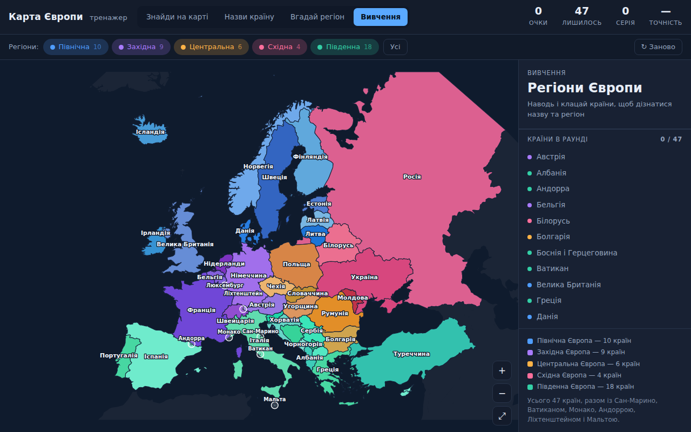

# Політична карта Європи — тренажер

Інтерактивна карта Європи для підготовки: **47 країн**, поділених на п'ять регіонів —
Північна, Західна, Центральна, Східна та Південна Європа.



Відкрити: `web/europe-quiz/index.html` — просто подвійним кліком, без сервера
й без інтернету. Усе працює офлайн, дані карти вбудовані у файл `map-data.js`.

## Режими

| Режим | Що робити |
|---|---|
| **Знайди на карті** | Показано назву — клацни потрібну країну |
| **Назви країну** | Країна підсвічена — обери назву з чотирьох варіантів |
| **Вгадай регіон** | Показано країну — обери її регіон |
| **Вивчення** | Карта з підписами: наводь і клацай, щоб запам'ятати |

Порядок країн щоразу випадковий. Регіони вмикаються й вимикаються чипами
згори, тож можна тренувати, наприклад, лише Балкани або лише Північ.
Обраний режим і регіони зберігаються між заходами.

Гарячі клавіші: `1`–`4` — варіанти відповіді, `Z` — наблизити поточну країну,
`R` — почати раунд заново, `Esc` — показати всю карту.

## Країни за регіонами

* **Північна (10)** — Ісландія, Норвегія, Швеція, Фінляндія, Данія, Естонія,
  Латвія, Литва, Велика Британія, Ірландія
* **Західна (9)** — Франція, Німеччина, Нідерланди, Бельгія, Люксембург,
  Швейцарія, Австрія, Монако, Ліхтенштейн
* **Центральна (6)** — Польща, Чехія, Словаччина, Угорщина, Румунія, Болгарія
* **Східна (4)** — Україна, Білорусь, Молдова, Росія
* **Південна (18)** — Португалія, Іспанія, Андорра, Італія, Сан-Марино, Ватикан,
  Мальта, Словенія, Хорватія, Боснія і Герцеговина, Сербія, Чорногорія, Косово,
  Північна Македонія, Албанія, Греція, Кіпр, Туреччина

Мікродержави — Сан-Марино, Ватикан, Монако, Ліхтенштейн, Андорра, Мальта та
Люксембург — є на карті повноцінними країнами. Щоб у них можна було влучити,
кожна має кружечок-мішень, який зменшується разом із наближенням: чим більший
зум, тим точніше треба клацати.

Межі регіонів — річ умовна, різні підручники ділять Європу по-різному.
Тут узято поділ, у якому кожна країна належить рівно до одного регіону.

## Як оновити карту

`map-data.js` згенеровано зі щитів Natural Earth 1:50m (public domain).
Файл не редагують руками — його перебудовує скрипт:

```sh
curl -o countries-50m.json https://cdn.jsdelivr.net/npm/world-atlas@2/countries-50m.json
python3 tools/gen-map.py countries-50m.json map-data.js
```

Скрипт проєктує контури (рівновелика азимутальна проєкція Ламберта з центром
на Європі), обрізає їх до кадру «Ісландія — Урал, Крит — Нордкап», спрощує
алгоритмом Дугласа-Пекера і рахує точку для підпису кожної країни.
Крим на карті належить Україні — у вихідних даних Natural Earth він
віднесений до Росії, і скрипт це виправляє.
